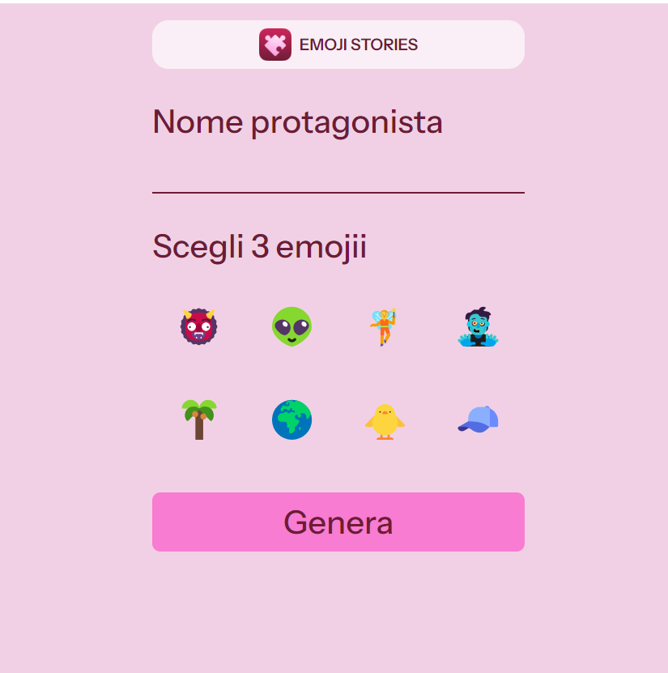
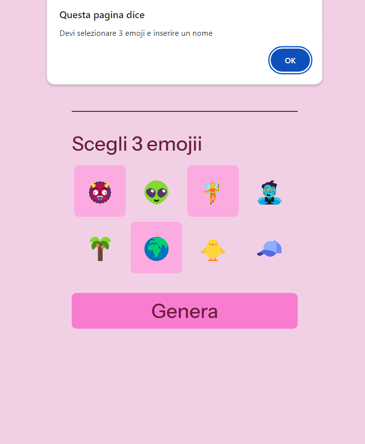
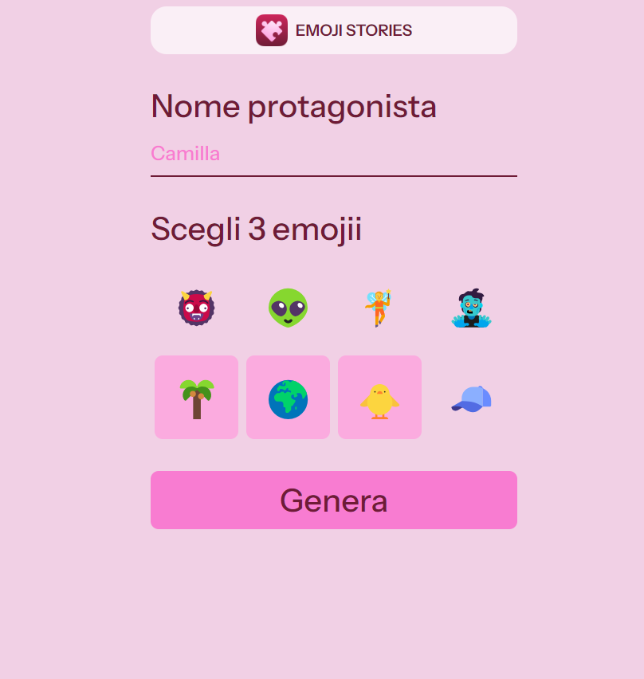

# emojii stories

Questo progetto è una piccola web app che utilizza le API di chatgpt per creare delle storie dinamiche in base al nome che viene inserito nell'input e alle emoji che vengono scelte dall'utente.

## Descrizione

Questo progetto è stato realizzato con HTML, CSS, JavaScript e le API di chatgpt

## Funzionalità

La web app include le seguenti funzionalità:

- storie dinamiche in base al nome e alle emoji selezionate
- possibilità di generare la continuazione della storia premendo il tasto "avanti"
- messaggio di errore se non vengono scelte tre emoji o non viene inserito il nome

## Tecnologie utilizzate

La web app è stata sviluppata utilizzando le seguenti tecnologie:

- HTML
- CSS
- JavaScript
- API 

## Licenza

<!-- Questo progetto è stato rilasciato sotto la licenza MIT. Per ulteriori informazioni, leggere il file `LICENSE.md`. -->

## Crediti

Questo progetto è stato sviluppato da Katia Falletti.(https://it.linkedin.com/in/katia-falletti-616890225?trk=people-guest_people_search-card)
